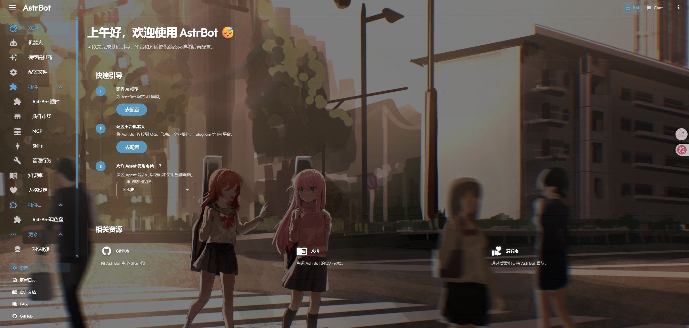
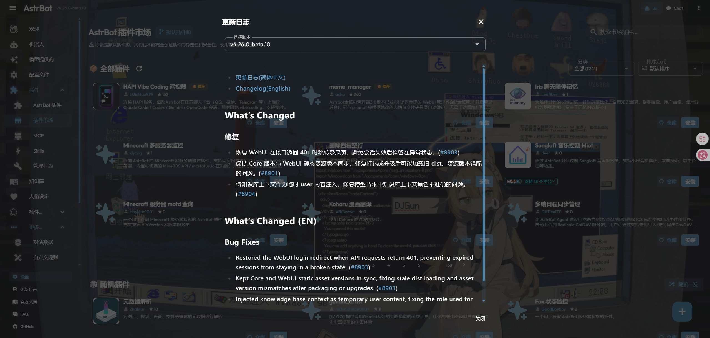

# AstrBot调色盘

AstrBot调色盘是一个 AstrBot WebUI 美化插件。当前版本聚焦于背景图库、透明界面、Liquid Glass 设置页、文字可读性增强和壁纸主题色联动，让 Dashboard 可以在不修改 AstrBot 源码的前提下换上自定义壁纸。

当前已测试兼容 AstrBot `4.26.6`。

> 当前版本：`0.4.8`
>
> 兼容 AstrBot：`>=4.26.0-beta1`，已测试兼容 `4.26.6`

## 功能

- 分别上传横屏和竖屏 WebUI 背景图片，并通过真实压缩缩略图库一键切换。
- 支持横屏/竖屏设备自动使用对应壁纸，旋转或拖拽改变方向时会叠化切换。
- 支持打开或刷新 WebUI 时从当前方向图库随机切换背景。
- 调整背景填充方式、位置、遮罩、模糊、灰度、亮度、对比度和饱和度。
- 将 Dashboard 常驻面板透明化，支持完全透明的悬浮文字效果。
- 提供文字和图标可读性增强，包括柔和阴影和强力描边。
- 自动读取当前壁纸主题色，并同步 AstrBot 主色与辅色。
- 提供 Apple-like Liquid Glass 风格的分标签插件设置页，可在插件详情页中直接配置。
- 设置页所有标签都带有效果预览，并叠加示例 UI，方便直观看到遮罩、滤镜、界面底色和文字增强效果。
- 可选在 AstrBot 系统统计页追加模型 Token 明细，查看每个模型的输入、输出、缓存命中和命中率。
- 透明化 AstrBot 顶栏、选项卡、插件说明、安装窗口、更新日志、WebChat 等常见深色背景区域。
- 首次注入后自动推荐切换到 AstrBot 深色主题，用户仍可在 AstrBot 设置中改回其他主题。

## 效果展示








## 安装

进入 AstrBot 插件目录：

```bash
cd /path/to/AstrBot/data/plugins
git clone https://github.com/Sisyphbaous-DT-Project/astrbot_plugin_palette.git
```

然后在 AstrBot WebUI 中重载插件，或重启 AstrBot。

插件加载后，AstrBot 插件列表中应显示：

- 插件名：`astrbot_plugin_palette`
- 展示名：`AstrBot调色盘`
- 版本：`0.4.8`

## 使用

1. 打开 AstrBot WebUI。
2. 进入插件管理，找到 `AstrBot调色盘`。
3. 打开插件设置页。
4. 分别在横屏图库或竖屏图库上传一张或多张背景图片。
5. 在对应缩略图库中点击图片，切换该方向的当前 WebUI 背景。
6. 按喜好调整透明度、遮罩、背景滤镜、文字增强、随机背景和主题色联动。
7. 保存后刷新 WebUI，背景会自动应用到 Dashboard。

支持的背景图片格式：

- `jpg`
- `jpeg`
- `png`
- `webp`
- `gif`

单张图片最大 `10MB`。

## 配置项

| 配置项 | 说明 | 默认值 |
| --- | --- | --- |
| `enabled` | 是否启用 WebUI 美化 | `true` |
| `background_image` | 当前背景图片文件名 | `""` |
| `background_images` | 背景图库文件名列表 | `[]` |
| `landscape_background_image` | 横屏当前背景图片文件名 | `""` |
| `landscape_background_images` | 横屏背景图库文件名列表 | `[]` |
| `portrait_background_image` | 竖屏当前背景图片文件名 | `""` |
| `portrait_background_images` | 竖屏背景图库文件名列表 | `[]` |
| `background_fit` | 背景填充方式，可选 `cover`、`contain`、`stretch`、`auto` | `cover` |
| `background_position` | 背景位置 | `center center` |
| `background_blur` | 背景模糊强度，单位 px | `0` |
| `background_dim` | 全局暗色遮罩强度 | `0.5` |
| `surface_opacity` | 常驻面板底色强度，`0` 为透明 | `0.0` |
| `text_enhancement_mode` | 文字增强模式，可选 `off`、`soft_shadow`、`stroke` | `soft_shadow` |
| `text_enhancement_strength` | 文字增强强度 | `1.0` |
| `background_grayscale` | 背景灰度 | `0.0` |
| `background_brightness` | 背景亮度 | `1.0` |
| `background_contrast` | 背景对比度 | `1.0` |
| `background_saturation` | 背景饱和度 | `1.0` |
| `random_background_on_load` | 打开或刷新 WebUI 时随机背景 | `false` |
| `auto_theme_enabled` | 是否自动同步壁纸主题色 | `true` |
| `detailed_token_stats_enabled` | 是否在系统统计页显示模型 Token 明细 | `false` |
| `theme_primary` | 自动生成的 AstrBot 主色，格式为 `#RRGGBB` | `""` |
| `theme_secondary` | 自动生成的 AstrBot 辅色，格式为 `#RRGGBB` | `""` |
| `advanced_css` | 追加到主题 CSS 末尾的高级自定义 CSS | `""` |

## 主题色联动

`0.3.0` 会在当前壁纸切换后读取图片主题色，生成一组适合 UI 使用的主色和辅色。主题色联动开启时，插件会把这两个颜色写入 AstrBot 已有的浏览器本地配置：

```text
themePrimary
themeSecondary
```

同时，插件会注入一小段运行时样式，让按钮、强调色和部分 Vuetify 主题变量无需刷新也能马上跟随壁纸变化。

关闭“主题色联动”或禁用调色盘时，插件会恢复启用联动前保存的 AstrBot 主色和辅色。没有上传壁纸时，主题色联动不会主动改色。

如果更换了图片但想手动重新读取颜色，可以在设置页点击“重新读取壁纸主题色”。

## 背景图库

上传图片会加入对应方向图库；如果该方向还没有当前背景，第一张上传图片会自动作为当前方向背景。已有当前背景时，上传不会打断正在使用的壁纸。点击缩略图后，插件会把该图片保存为对应方向的当前背景，并重新读取主题色。

`0.4.4` 起，背景图库分为横屏壁纸和竖屏壁纸。上传到横屏分区的图片会在电脑或横屏视口优先显示；上传到竖屏分区的图片会在手机或竖屏视口优先显示。插件不会按图片尺寸自动分类，图片属于哪个方向完全由上传入口决定。

旧版单图库配置会默认显示在横屏图库里；竖屏图库为空时仍会自动回退到旧背景。删除背景图片会删除这个文件在横屏、竖屏和旧图库里的所有引用，避免配置里留下已经不存在的图片。

Dashboard 会监听视口方向变化。浏览器从竖屏切到横屏时，会预加载横屏当前壁纸并以叠化方式切换；横屏切回竖屏时同理。如果某个方向还没有壁纸，会自动回退到旧背景或另一方向壁纸，避免黑屏。

`0.4.5` 起，方向切换会先等待目标壁纸加载和解码，再用双层背景进行更明显的叠化过渡。如果横屏和竖屏最终回退到同一张图片，视觉上可能不会出现明显变化，这是正常情况。

`0.4.1` 起，图库缩略图会在上传时或首次访问时生成最大边 `320px` 的压缩缓存。设置页图库和效果预览只加载小图，不再把原图 base64 当缩略图或预览图使用，因此云端部署和多张 4K 壁纸场景下打开设置页会更轻。Dashboard 实际背景仍使用原图，不影响最终壁纸质量。

开启“打开或刷新时随机背景”后，Dashboard 每次重新打开或整页刷新都会从当前方向图库随机选一张，并写回该方向当前背景。页面内路由切换和横竖屏旋转不会触发再次随机，避免使用过程中频繁换图。

“拉伸铺满”会让图片完整铺满窗口且不裁切，但可能改变原图比例。

## 插件设置页

`0.4.0` 将设置页重构为分标签布局：

- `图库`：上传、切换、删除背景，并设置打开或刷新时随机背景。
- `外观`：调整背景填充、位置、遮罩、模糊、界面底色和基础滤镜。
- `可读性`：调整文字增强、灰度、亮度、对比度和饱和度。
- `主题`：查看壁纸主题色联动状态，并手动重新读取主题色。
- `高级`：追加自定义 CSS。

每个标签都带有当前壁纸效果预览。预览图上会叠加一套小型示例 UI，用来直观看到界面底色、文字阴影、按钮和标签在当前壁纸上的实际可读性。

## 系统统计增强

`0.4.3` 起，可以在设置页“高级”标签里开启“系统统计模型 Token 明细”。开启后，调色盘会在 AstrBot 系统统计页的模型调用区域追加一个明细面板，展示总计以及每个模型的输入 token、输出 token、缓存命中 token 和缓存命中率。

该功能只读取 AstrBot 已有的 `ProviderStat` 统计记录，不改变模型调用、token 采集或 AstrBot 原生统计接口。关闭开关后，增强面板会从 Dashboard 移除。

## 工作方式

本插件不会修改 AstrBot 源码。

为了让 Dashboard 主页面能加载插件主题，本插件会在运行时向 AstrBot 当前实际服务的 WebUI 入口注入一段带标记的启动脚本。插件会优先跟随 `--webui-dir` 指定目录，其次使用兼容的 `data/dist`，桌面端或新版本 AstrBot 使用内置 WebUI 时会自动注入内置 `astrbot/dashboard/dist`。

如果内置 WebUI 目录不可写，插件会复制一份内置 WebUI 到 `data/dist` 并完成注入，设置页会提示需要重启 AstrBot 后生效。注入前会在插件数据目录中备份原始 `index.html`，之后重复注入会替换已有标记块，避免重复写入。

注入标记如下：

```html
<!-- astrbot_plugin_palette:start -->
...
<!-- astrbot_plugin_palette:end -->
```

背景图片保存在插件数据目录下：

```text
data/plugin_data/astrbot_plugin_palette/backgrounds
```

图库缩略图缓存在：

```text
data/plugin_data/astrbot_plugin_palette/thumbnails
```

Dashboard 入口备份保存在：

```text
data/plugin_data/astrbot_plugin_palette/dashboard_backups
```

## Web API

插件通过 AstrBot 插件 Web API 暴露接口。实际访问路径由 AstrBot 转发到 `/api/v1/plugins/extensions/...`。

| 方法 | 路径 | 说明 |
| --- | --- | --- |
| `GET` | `/astrbot_plugin_palette/status` | 获取插件版本、路径和注入状态 |
| `GET` | `/astrbot_plugin_palette/config` | 获取当前公开配置 |
| `POST` | `/astrbot_plugin_palette/config` | 保存配置 |
| `GET` | `/astrbot_plugin_palette/theme.css` | 获取运行时主题 CSS |
| `GET` | `/astrbot_plugin_palette/background-preview` | 获取当前背景预览 |
| `GET` | `/astrbot_plugin_palette/background-thumbnail` | 获取图库压缩缩略图 |
| `GET` | `/astrbot_plugin_palette/token-stats` | 获取模型 Token 明细统计 |
| `POST` | `/astrbot_plugin_palette/upload-background` | 上传背景图片到图库 |
| `POST` | `/astrbot_plugin_palette/upload-background/<orientation>` | 上传背景图片到横屏或竖屏图库 |
| `POST` | `/astrbot_plugin_palette/backgrounds/select` | 切换当前背景图片 |
| `POST` | `/astrbot_plugin_palette/backgrounds/delete` | 删除图库背景图片 |
| `POST` | `/astrbot_plugin_palette/backgrounds/random-select` | 随机切换并写回当前背景 |
| `POST` | `/astrbot_plugin_palette/theme-colors/recalculate` | 重新读取当前壁纸主题色 |
| `GET` | `/astrbot_plugin_palette/backgrounds/<filename>` | 读取背景图片 |

## 深色主题提示

透明背景更适合搭配 AstrBot 深色模式。插件注入脚本第一次运行时，会向浏览器 `localStorage` 写入：

```text
themeMode=dark
uiTheme=PurpleThemeDark
astrbot_palette_dark_theme_bootstrapped=1
```

这只执行一次。用户之后在 AstrBot WebUI 中手动改回浅色或跟随系统，插件不会反复覆盖。

## 安全边界

- 不修改 AstrBot 源码。
- 只写入 AstrBot 当前使用的 WebUI 入口和插件自己的数据目录；内置 WebUI 不可写时才会准备 `data/dist` 降级副本。
- 高级 CSS 会拦截 `@import` 和外链 `url()`，避免引入外部资源。
- 背景文件名会被限制为插件生成的本地文件名，避免路径穿越。
- 上传图片会检查扩展名、大小和文件头。

## 开发检查

在插件仓库根目录运行：

```bash
PYTHONPATH=/path/to/AstrBot python -m py_compile main.py palette/*.py
node --check pages/settings/app.js
node --check pages/settings/liquid-glass.js
python -m json.tool _conf_schema.json
git diff --check
```

如果要在本地 AstrBot 中测试，建议复制插件目录到 `data/plugins/astrbot_plugin_palette`，不要使用软链接或 bind mount。

## 更新日志

完整更新日志见 [CHANGELOG.md](CHANGELOG.md)。版本化记录保存在 [changelogs](changelogs) 目录。

## 版本计划

`0.1.0` 已提供背景图上传、运行时注入、透明化和可读性增强。

`0.2.0` 新增壁纸主题色联动，可以自动读取壁纸颜色并同步 AstrBot 主色与辅色。

`0.3.0` 新增多背景图库、缩略图切换、刷新随机背景和拉伸铺满。

`0.4.0` 将插件设置页重构为 Apple-like Liquid Glass 分标签界面，并补齐全标签效果预览、示例 UI、选项卡可读性和顶栏黑线修复。

`0.4.1` 将图库缩略图改为后端生成并缓存的 320px 小图，优化云端部署和多张 4K 壁纸场景下的设置页加载速度。

`0.4.2` 修复桌面端和内置 WebUI 部署下的注入路径兼容问题，不再只依赖 `data/dist/index.html`。

`0.4.3` 新增系统统计模型 Token 明细增强，可选展示每个模型的输入、输出、缓存命中和缓存命中率。

`0.4.4` 新增横屏/竖屏两套背景图库，并按视口方向自动选择对应壁纸。

`0.4.5` 优化横竖屏方向切换的叠化过渡，减少旋转或窗口变化时的硬切感。

`0.4.6` 确认兼容 AstrBot `4.26.4`，核心插件 API、设置页桥接、WebUI 注入路径和统计页增强均保持可用。

`0.4.7` 确认兼容 AstrBot `4.26.5`，核心插件 API、设置页桥接、WebUI 注入路径和系统统计增强均保持可用。

`0.4.8` 已测试兼容 AstrBot `4.26.6`，核心插件 API、设置页桥接、WebUI 注入路径和系统统计增强均保持可用。

后续版本会继续补齐更多页面的透明化细节，并探索更完整的主题色板推导。

## 作者

`C₂₂H₂₅NO₆`
