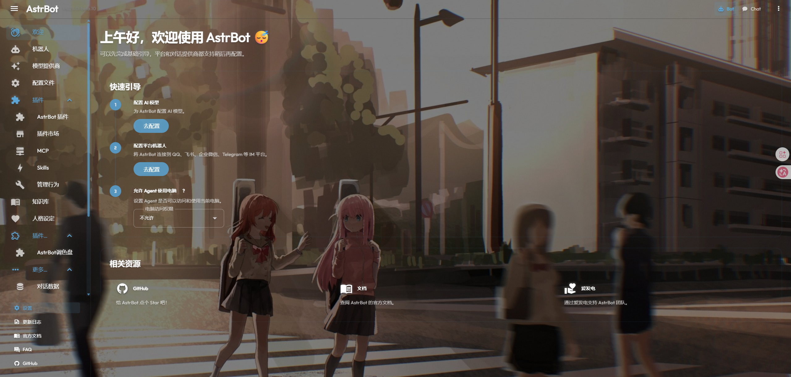
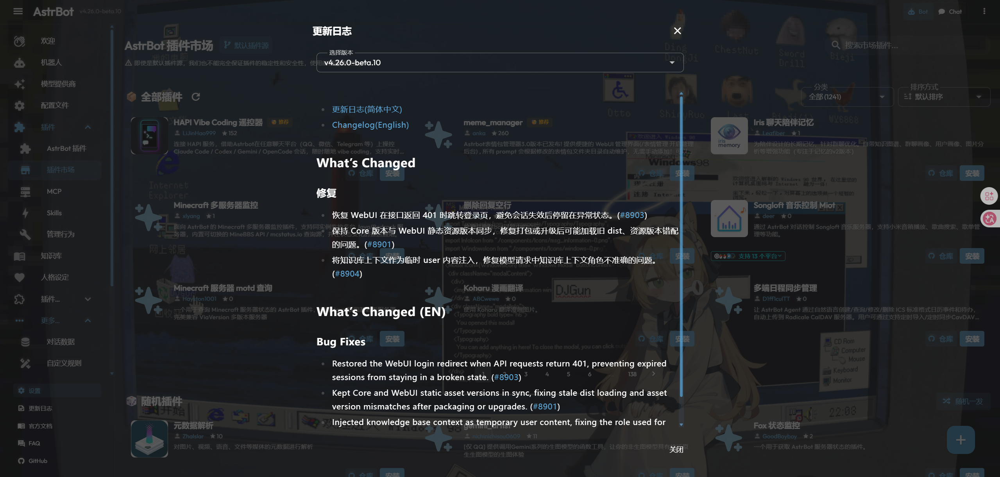

# AstrBot调色盘

<p align="center">
  
</p>

AstrBot调色盘是一个 AstrBot WebUI 美化插件。当前版本聚焦于背景图库、透明界面、Liquid Glass 设置页、文字可读性增强和壁纸主题色联动，让 Dashboard 可以在不修改 AstrBot 源码的前提下换上自定义壁纸。

当前已核对兼容 AstrBot `4.28.2`。

> 当前版本：`0.5.2`
>
> 兼容 AstrBot：`>=4.26.0-beta1`，已核对 `4.28.2` 源码及数据库行为；配置页和 ChatUI 的浏览器验收基于 `4.28.1`。本轮未使用 `4.28.2` Dashboard 构建资源重新验收浏览器页面，`4.26/4.27` 保留兼容规则。

## 功能

- 分别上传横屏和竖屏 WebUI 背景素材，并通过真实压缩缩略图库一键切换。
- 支持 MP4/WebM 视频、GIF/动态 WebP 和自包含 SVG，提供动态开关、持久化封面和独立素材预览。
- 从浏览器选择的 Wallpaper Engine 目录识别原视频和静态原图片，一键加入指定方向图库；scene/web/application 专用类型跳过。
- 支持横屏/竖屏设备自动使用对应壁纸，旋转或拖拽改变方向时会叠化切换。
- 支持打开或刷新 WebUI 时从当前方向图库随机切换背景。
- 支持按自定义间隔（1～1440 分钟）定时随机轮换背景，不会连续重复当前图，页面隐藏时自动暂停。
- 调整背景填充方式、位置、遮罩、模糊、灰度、亮度、对比度和饱和度。
- 将 Dashboard 常驻面板透明化，支持完全透明的悬浮文字效果。
- 主要信息框、组件管理页面和侧栏当前选中项支持统一调节毛玻璃强度；设为 `0` 时关闭新增玻璃装饰，信息框和组件管理表面恢复透明，侧栏仍保留原有选中底色。
- 窄屏浮层侧栏支持独立的毛玻璃强度 `mobile_sidebar_glass`（默认 `18`，范围 `0`–`40` px），避免手机或窄窗口下透明侧栏与正文重叠；设为 `0` 时恢复透明，与界面毛玻璃 `stats_card_blur` 互不影响。
- 提供文字和图标可读性增强，包括柔和阴影和强力描边。
- 自动读取当前壁纸主题色，并同步 AstrBot 主色与辅色。
- 提供 Apple-like Liquid Glass 风格的分标签插件设置页，可在插件详情页中直接配置。
- 设置页所有标签都带有效果预览，并叠加示例 UI，方便直观看到遮罩、滤镜、界面底色和文字增强效果。
- 可选在 AstrBot 系统统计页追加模型 Token 明细，查看每个模型的输入、输出、缓存命中和命中率。
- 透明化 AstrBot 顶栏、选项卡、插件说明、安装窗口、更新日志、WebChat 等常见深色背景区域。ChatUI 欢迎区和输入区外壳不重复叠色，导航按钮默认透明并保留悬停、键盘聚焦及选中反馈；输入框和消息内容保持原有可读性。
- 首次注入后自动推荐切换到 AstrBot 深色主题，用户仍可在 AstrBot 设置中改回其他主题。

插件根目录提供符合 AstrBot 插件规范的 `logo.png`（1:1、`256x256` PNG），安装后会自动显示在插件市场和插件列表中。

## 效果展示








## 安装

进入 AstrBot 插件目录：

```bash
cd /path/to/AstrBot/data/plugins
git clone https://github.com/Sisyphbaous-DT-Project/astrbot_plugin_palette.git
```

然后在 AstrBot WebUI 中重载插件，或重启 AstrBot。

插件加载后，AstrBot 插件列表中应显示：

- 插件名：`astrbot_plugin_palette`
- 展示名：`AstrBot调色盘`
- 版本：`0.5.2`

## 使用

1. 打开 AstrBot WebUI。
2. 进入插件管理，找到 `AstrBot调色盘`。
3. 打开插件设置页。
4. 分别在横屏图库或竖屏图库上传一项或多项背景素材。
5. 在对应缩略图库中点击素材，切换该方向的当前 WebUI 背景。
6. 按喜好调整透明度、遮罩、背景滤镜、文字增强、随机背景、定时轮换和主题色联动。
7. 保存后刷新 WebUI，背景会自动应用到 Dashboard。

支持 JPG/JPEG、PNG、WebP、GIF、MP4、WebM、SVG。`0.5.2` 起不再对原图片、视频、SVG 设置插件文件体积上限；文件 MIME 为空或扩展名不准确时以真实内容为准。浏览器解码能力、内存、服务器及反向代理的请求体与超时设置仍会影响超大素材的实际上传和播放。

### 动态背景与封面

视频默认静音、循环、内联播放。普通 H.264 MP4、VP8/VP9 WebM 是优先支持的编码组合；MP4/WebM 是容器名称，可播放性仍取决于浏览器，本插件不会自动转码。上传时浏览器先读取代表画面生成封面，无法解码时给出错误、不加入图库。

GIF/动态 WebP 由现有 Pillow 提取代表帧。视频/SVG 的封面由浏览器 canvas 生成，与原素材封装成一次上传；服务器校验格式、大小和尺寸后保存。封面源图限制 `4MiB` / 最大边 `4096px`，落盘限制最大边 `1280px`。新图片也生成静态代表帧。无需安装 FFmpeg 或 SVG 栅格化程序，继续使用 AstrBot 环境中的 Pillow。

图库与默认效果预览仍只加载最大边 `320px` 的静态缩略图，Liquid Glass 使用同一小图。点击图库项旁的“预览”才打开原素材，显示当前遮罩、滤镜、填充方式和位置；关闭预览、切换标签或隐藏页面会停止并释放预览。

新增的导入方向菜单、操作按钮、素材标识和预览弹窗沿用原设置页的 Liquid Glass 颜色、圆角与玻璃变量，支持深浅主题与窄屏布局。AstrBot 的设置页位于沙箱 iframe，独立预览由主页面注入脚本代为鉴权下载并传回素材字节；设置页不读取或接收登录令牌。升级插件后需要完整刷新 WebUI，让新版注入脚本生效。

`dynamic_background_enabled` 默认开启。关闭或系统启用“减少动态效果”时，视频、动图和 SVG 使用持久化静态封面。SVG 不一定有动画，支持范围是图片模式中的常规自包含 SVG/CSS 声明式动画。旧 GIF/动态 WebP 的封面会在首次需要时生成，无需重新上传。

Dashboard 使用带 Bearer 鉴权的 fetch 完整下载素材，再生成本地 Blob URL 播放，不把令牌放进媒体 URL。视频需整段下载后才准备首帧，大视频首次加载会等待更久；远程部署需上传和下载原视频，服务器/反向代理也必须允许对应请求体和超时（设置页 bridge 上传超时约 60 秒）。本版不提供 Range 流式播放，也不承诺大型创意工坊视频均可导入。

`0.5.2` 起默认使用 IndexedDB 本机缓存，首次下载后自动保存原素材和封面，后续刷新、关闭浏览器再打开或重启机器优先读取本地，避免重复下载完整视频。已在 `0.5.1` 或更早版本设置的壁纸也会在升级并刷新 WebUI 后首次使用时自动缓存，无需重新上传、选择或迁移配置；随机轮换到的素材按需缓存，不预先下载全部图库。

普通素材的本机缓存共用 `1GiB`（1024MiB）预算，超过后淘汰较久未使用的普通素材。单个超过 `1GiB` 的大素材也会缓存，单独保留、不占普通预算、不参与普通素材的淘汰；如果使用的全是这类大素材，插件不按总量主动淘汰它们，实际保存仍受浏览器存储配额和可用空间影响。图库页分开显示普通/大素材占用，并提供“清理本机缓存”，只清本浏览器磁盘副本，不删除服务器图库或中断当前播放。成功读取最新登录配置后才使用对应素材缓存，删除或失去图库引用的缓存会在下一次配置同步时清理；清理期间尚未完成的旧下载不会回填缓存。设置页独立素材预览同样可以复用主页面缓存。

缓存属于同一浏览器配置和网站来源（协议、域名及端口），不在不同浏览器/地址间共享，也不会保存登录令牌。清理网站数据、无痕窗口结束、浏览器空间回收会使缓存消失；浏览器禁止存储、配额不足或存储读写失败时自动回退联网下载，仍可正常播放。缓存不使整个 AstrBot 离线可用：配置和权限仍向服务器核验，视频解码也仍需要时间。

普通外观刷新和路由切换复用播放元素与进度。页面隐藏暂停视频，恢复后继续；切换、禁用或离开页面释放视频和废弃下载。新视频准备失败保留旧背景，首次失败使用封面。图片缓存保持 4 项保护型 LRU，另加 `128MiB` 字节预算；完整视频仅在准备/在用/叠化期间保留，失去引用后立即回收，过渡期间可临时超过预算。

主动暂停中断尚未完成的播放不会永久关闭视频。临时失败时，恢复可见、网络恢复或在设置页明确点击“刷新”/保存可触发一次重试；正常播放的普通路由刷新仍复用元素和进度，不循环重试或反复下载。背景下载限制 `60 秒`，设置变更会及时取消旧下载与首帧准备，仍按原来的刷新互斥合并应用最新配置。

外观保存只提交可编辑设置，保留服务端最新的图库、当前素材和自动取色，避免另一个设置页的旧快照覆盖新上传。页面隐藏或离开时，等待配置、样式和轮换响应的旧刷新也会失效；迟到响应不再启动媒体准备，恢复可见后重新读取最新配置。

### Wallpaper Engine 导入

图库页点击“从 Wallpaper Engine 导入”，选择本地目录，再选横屏或竖屏目标，点击某项“导入”。可以选择 Steam 的 `steamapps/workshop/content/431960`、单个项目目录或普通静态图片目录；不自动扫描电脑，也不把 Windows 路径发送到服务器读取。

支持 `project.json` 中 `file` 指向的 MP4/WebM 原视频、JPG/JPEG/PNG/WebP 原图片；缺少 `type` 时根据真实主文件判断。列表可使用项目预览图，真正上传的始终是主文件。普通图片目录支持独立原图片；项目预览、内部纹理和 scene/web/application 内容不作为独立壁纸。损坏元信息、主文件缺失、越界路径和专用类型只影响对应项并显示跳过统计。

目录授权优先使用只读 `showDirectoryPicker`，受浏览器、安全上下文和 iframe 限制；另有“选择目录（兼容方式）”的 `webkitdirectory` 回退。取消选择保持图库与配置；不支持目录选择时仍可使用普通文件上传。远程 AstrBot 同样由浏览器读取所选本地文件后上传。导入不修改、移动、删除源素材，不回写 Wallpaper Engine。

列表显示原文件体积，`0.5.2` 起不再按图片/视频体积禁用导入按钮。失败可重试，同次会话成功条目标记已导入，部分成功不回滚。已有当前背景时只增加素材；目标方向无当前背景时第一项成为当前背景。本版不支持场景渲染、解包、网页执行、录屏转换或读取当前桌面壁纸。

同一页面再次选择同一目录时，按素材相对路径、文件名、体积与修改时间恢复已导入标记；文件变化或不同路径仍可导入，不做跨会话去重。导入过程中只更新状态按钮，保留已经生成的列表预览。多个标签页上传或删除时，原素材处理可并发，最终图库配置更新串行合并，避免成功文件失去图库引用。

## 配置项

| 配置项 | 说明 | 默认值 |
| --- | --- | --- |
| `enabled` | 是否启用 WebUI 美化 | `true` |
| `dynamic_background_enabled` | 允许动态背景；关闭或系统减少动态效果时使用静态封面 | `true` |
| `background_image` | 当前背景素材文件名 | `""` |
| `background_images` | 背景图库文件名列表 | `[]` |
| `landscape_background_image` | 横屏当前背景素材文件名 | `""` |
| `landscape_background_images` | 横屏背景图库文件名列表 | `[]` |
| `portrait_background_image` | 竖屏当前背景素材文件名 | `""` |
| `portrait_background_images` | 竖屏背景图库文件名列表 | `[]` |
| `background_fit` | 背景填充方式，可选 `cover`、`contain`、`stretch`、`auto` | `cover` |
| `background_position` | 背景位置 | `center center` |
| `background_blur` | 背景模糊强度，单位 px | `0` |
| `background_dim` | 全局暗色遮罩强度 | `0.5` |
| `surface_opacity` | 常驻面板底色强度，`0` 为透明；Bot / ChatUI 顶栏、桌面侧栏和正文外围共用一层底色，避免接缝和重复叠色 | `0.0` |
| `stats_card_blur` | 主要信息框、组件管理页面和侧栏当前选中项的毛玻璃强度，范围 `0`–`40` px；`0` 表示关闭新增的模糊与玻璃装饰，让信息框和组件管理表面恢复透明，同时保留侧栏原有选中底色；AstrBot 4.28 配置页工具栏在所有档位下均随正文滚动，正文在应用顶栏下方独立滚动，避免黑条与叠字 | `14` |
| `mobile_sidebar_glass` | 窄屏浮层侧栏的毛玻璃强度，范围 `0`–`40` px，作用于手机或窄窗口下的主侧栏和聊天页侧栏；`0` 表示关闭侧栏的底色、模糊和阴影并恢复透明，独立于 `stats_card_blur` | `18` |
| `text_enhancement_mode` | 文字增强模式，可选 `off`、`soft_shadow`、`stroke` | `soft_shadow` |
| `text_enhancement_strength` | 文字增强强度 | `1.0` |
| `background_grayscale` | 背景灰度 | `0.0` |
| `background_brightness` | 背景亮度 | `1.0` |
| `background_contrast` | 背景对比度 | `1.0` |
| `background_saturation` | 背景饱和度 | `1.0` |
| `random_background_on_load` | 打开或刷新 WebUI 时随机背景 | `false` |
| `background_rotation_enabled` | 是否按间隔定时随机轮换背景 | `false` |
| `background_rotation_interval_minutes` | 定时轮换间隔，单位分钟，范围 `1`–`1440` | `30` |
| `auto_theme_enabled` | 是否自动同步壁纸主题色 | `true` |
| `detailed_token_stats_enabled` | 是否在系统统计页显示模型 Token 明细 | `false` |
| `theme_primary` | 自动生成的 AstrBot 主色，格式为 `#RRGGBB` | `""` |
| `theme_secondary` | 自动生成的 AstrBot 辅色，格式为 `#RRGGBB` | `""` |
| `advanced_css` | 追加到主题 CSS 末尾的高级自定义 CSS | `""` |

## 主题色联动

`0.3.0` 会在当前壁纸切换后读取图片主题色，生成一组适合 UI 使用的主色和辅色。主题色联动开启时，插件会把这两个颜色写入 AstrBot 已有的浏览器本地配置：

```text
themePrimary
themeSecondary
```

同时，插件会注入一小段运行时样式，让按钮、强调色和部分 Vuetify 主题变量无需刷新也能马上跟随壁纸变化。

关闭“主题色联动”或禁用调色盘时，插件会恢复启用联动前保存的 AstrBot 主色和辅色。没有上传壁纸时，主题色联动不会主动改色。

如果更换了图片但想手动重新读取颜色，可以在设置页点击“重新读取壁纸主题色”。

## 背景图库

上传图片会加入对应方向图库；如果该方向还没有当前背景，第一张上传图片会自动作为当前方向背景。已有当前背景时，上传不会打断正在使用的壁纸。点击缩略图后，插件会把该图片保存为对应方向的当前背景，并重新读取主题色。

`0.4.4` 起，背景图库分为横屏壁纸和竖屏壁纸。上传到横屏分区的图片会在电脑或横屏视口优先显示；上传到竖屏分区的图片会在手机或竖屏视口优先显示。插件不会按图片尺寸自动分类，图片属于哪个方向完全由上传入口决定。

旧版单图库配置会默认显示在横屏图库里；竖屏图库为空时仍会自动回退到旧背景。删除背景素材会删除这个文件在横屏、竖屏和旧图库里的所有引用，避免配置里留下已经不存在的图片。

AstrBot 4.27.3 及更高版本的插件配置页支持逐项“恢复默认值”。这个操作只清空配置引用，不会删除背景原素材、缩略图和封面；需要清理素材时请优先在调色盘图库中删除，已经恢复默认后留下的文件需手动清理插件数据目录里的 `backgrounds`、`thumbnails` 和 `covers` 文件夹。

Dashboard 会监听视口方向变化。浏览器从竖屏切到横屏时，会预加载横屏当前壁纸并以叠化方式切换；横屏切回竖屏时同理。如果某个方向还没有壁纸，会自动回退到旧背景或另一方向壁纸，避免黑屏。

`0.4.5` 起，方向切换会先等待目标壁纸加载和解码，再用双层背景进行更明显的叠化过渡。如果横屏和竖屏最终回退到同一张图片，视觉上可能不会出现明显变化，这是正常情况。

`0.4.1` 起，图库缩略图会在上传时或首次访问时生成最大边 `320px` 的压缩缓存。设置页图库和效果预览只加载小图，不再把原图 base64 当缩略图或预览图使用，因此云端部署和多张 4K 壁纸场景下打开设置页会更轻。Dashboard 实际背景仍使用原图，不影响最终壁纸质量。

开启“打开或刷新时随机背景”后，Dashboard 每次重新打开或整页刷新都会从当前方向图库随机选一张，并写回该方向当前背景。页面内路由切换和横竖屏旋转不会触发再次随机，避免使用过程中频繁换图。

开启“定时轮换”后，Dashboard 会按设定间隔（默认 30 分钟，可设 1～1440 分钟）从当前视口方向的图库随机切换背景，沿用与“打开或刷新时随机”相同的选池和回退顺序，且不会连续选中正在使用的图片；图库只剩当前一张图时会静默跳过。轮换结果会写回全局配置，其他已打开的 WebUI 页面会同步叠化到新壁纸；开启主题色联动时主题色随新壁纸一起更新。页面隐藏（切后台、最小化）时轮换暂停，恢复可见后重新等待一个完整间隔，不会补播错过的次数。

同一浏览器（同源）打开多个 WebUI 标签页时，只有一个标签页负责触发轮换：优先使用 Web Locks 持续持有领导权，不支持时降级为 localStorage 租约（15 秒有效期、定时续租）；其余标签页通过 BroadcastChannel 和 storage 事件同步刷新。不同浏览器、不同域名或端口之间不做协调，各自独立轮换。

“拉伸铺满”会让图片完整铺满窗口且不裁切，但可能改变原图比例。

## 插件设置页

`0.4.0` 将设置页重构为分标签布局：

- `图库`：上传、切换、删除背景，并设置打开或刷新时随机背景与定时轮换。
- `外观`：调整背景填充、位置、遮罩、模糊、界面底色、信息框模糊和基础滤镜。
- `可读性`：调整文字增强、灰度、亮度、对比度和饱和度。
- `主题`：查看壁纸主题色联动状态，并手动重新读取主题色。
- `高级`：追加自定义 CSS。

每个标签都带有当前壁纸效果预览。预览图上会叠加一套小型示例 UI，用来直观看到界面底色、文字阴影、按钮和标签在当前壁纸上的实际可读性。

## 系统统计增强

`0.4.3` 起，可以在设置页“高级”标签里开启“系统统计模型 Token 明细”。开启后，调色盘会在 AstrBot 系统统计页的模型调用区域追加一个明细面板，展示总计以及每个模型的输入 token、输出 token、缓存命中 token 和缓存命中率。

该功能只读取 AstrBot 已有的 `ProviderStat` 统计记录，不改变模型调用、token 采集或 AstrBot 原生统计接口。关闭开关后，增强面板会从 Dashboard 移除。

## 工作方式

本插件不会修改 AstrBot 源码。

为了让 Dashboard 主页面能加载插件主题，本插件会在运行时向 AstrBot 当前实际服务的 WebUI 入口注入一段带标记的启动脚本。AstrBot `4.27.x` 起，插件把 `--webui-dir` 显式目录交给其公开 `resolve_dashboard_dist` 解析，并跟随核心的实际选择：核心接受显式目录则注入该目录；桌面托管模式（`ASTRBOT_DESKTOP_MANAGED=1`）下核心拒绝版本不匹配或资源不完整的显式目录时，插件跟随核心改选合格的 `data/dist` 或内置目录，核心未选出可用目录时不执行注入；`4.26.x` 保持兼容回退，显式目录优先，否则沿用旧版辅助函数判断，从而同时覆盖兼容的 `data/dist` 和内置 `astrbot/dashboard/dist`。

使用 `--webui-dir` 时建议传入实际存在的绝对路径，不要依赖 `~` 展开；如果自定义启动器直接通过程序接口传入目录，也应同时保留命令行参数，否则插件无法自动获知该目录。

如果内置 WebUI 目录不可写，插件会复制一份内置 WebUI 到 `data/dist` 并完成注入，设置页会提示需要重启 AstrBot 后生效。注入前会在插件数据目录中备份原始 `index.html`，之后重复注入会替换已有标记块，避免重复写入。

注入标记如下：

```html
<!-- astrbot_plugin_palette:start -->
...
<!-- astrbot_plugin_palette:end -->
```

背景素材保存在插件数据目录下：

```text
data/plugin_data/astrbot_plugin_palette/backgrounds
```

图库缩略图缓存在：

```text
data/plugin_data/astrbot_plugin_palette/thumbnails
```

持久化封面保存在 `data/plugin_data/astrbot_plugin_palette/covers`。删除素材时原文件、封面、缩略图和所有方向引用一并清理。视频/SVG 主题色从代表画面提取，不随每帧变化，保留手动重算；封面缺失或损坏时明确报错。

Dashboard 入口备份保存在：

```text
data/plugin_data/astrbot_plugin_palette/dashboard_backups
```

## Web API

插件通过 AstrBot 插件 Web API 暴露接口。实际访问路径由 AstrBot 转发到 `/api/v1/plugins/extensions/...`。

| 方法 | 路径 | 说明 |
| --- | --- | --- |
| `GET` | `/astrbot_plugin_palette/status` | 获取插件版本、路径和注入状态 |
| `GET` | `/astrbot_plugin_palette/config` | 获取当前公开配置 |
| `POST` | `/astrbot_plugin_palette/config` | 保存配置 |
| `GET` | `/astrbot_plugin_palette/theme.css` | 获取运行时主题 CSS |
| `GET` | `/astrbot_plugin_palette/background-preview` | 获取当前背景预览 |
| `GET` | `/astrbot_plugin_palette/background-thumbnail` | 获取图库压缩缩略图 |
| `GET` | `/astrbot_plugin_palette/background-cover?filename=...` | 读取鉴权静态封面 |
| `GET` | `/astrbot_plugin_palette/token-stats` | 获取模型 Token 明细统计 |
| `POST` | `/astrbot_plugin_palette/upload-background` | 上传背景素材到图库 |
| `POST` | `/astrbot_plugin_palette/upload-background/<orientation>` | 上传背景素材到横屏或竖屏图库 |
| `POST` | `/astrbot_plugin_palette/backgrounds/select` | 切换当前背景素材 |
| `POST` | `/astrbot_plugin_palette/backgrounds/delete` | 删除图库背景素材 |
| `POST` | `/astrbot_plugin_palette/backgrounds/random-select` | 随机切换并写回当前背景 |
| `POST` | `/astrbot_plugin_palette/theme-colors/recalculate` | 重新读取当前壁纸主题色 |
| `GET` | `/astrbot_plugin_palette/backgrounds/<filename>` | 读取背景素材 |

## 深色主题提示

透明背景更适合搭配 AstrBot 深色模式。插件注入脚本第一次运行时，会向浏览器 `localStorage` 写入：

```text
themeMode=dark
uiTheme=PurpleThemeDark
astrbot_palette_dark_theme_bootstrapped=1
```

这只执行一次。用户之后在 AstrBot WebUI 中手动改回浅色或跟随系统，插件不会反复覆盖。

## 安全边界

- 不修改 AstrBot 源码。
- 只写入 AstrBot 当前使用的 WebUI 入口和插件自己的数据目录；内置 WebUI 不可写时才会准备 `data/dist` 降级副本。
- 高级 CSS 会拦截 `@import` 和外链 `url()`，避免引入外部资源。
- 背景文件名会被限制为插件生成的本地文件名，避免路径穿越。
- 原素材按真实文件头与格式校验，插件不限制文件体积；生成的封面仍校验格式、尺寸和体积。
- 新素材按真实内容校验，视频检查容器结构与视频轨道，图片实际解码校验。视频/SVG 必须附带合法封面，全部成功后才入库；旧静态图片直接上传仍支持。
- SVG 拒绝脚本、事件属性、外部资源、非 SVG 内容、DOCTYPE/实体和不支持的样式转义，仅以图片模式加载、不插入应用 DOM；直读响应附带 `nosniff` 和 CSP sandbox。
- 沙箱预览通信同时核对 iframe 的 `contentWindow`、同源调色盘设置页路径和素材文件名，只下载本插件素材/封面；不接受任意 URL，不传递登录令牌，关闭预览会取消废弃请求。

公开配置保留全部旧字段，新增动态开关和各方向 `*_background_media` 信息。图库项新增 `media_type`、`animated`、`cover_url`、`size_bytes`。视频/SVG 的 `background-preview` 返回封面，绝不返回完整视频 base64。原上传路由不变；设置页通过 bridge 单文件上传封装 `PALETTE-MEDIA-1\n`、4 字节大端封面长度、封面 PNG 和原素材，服务器拆分校验。未附封面的外部视频/SVG 上传返回中文错误。

## 开发检查

在插件仓库根目录运行：

```bash
PYTHONPATH=/path/to/AstrBot python -m py_compile main.py palette/*.py
node --check pages/settings/app.js
node --check pages/settings/liquid-glass.js
node --check pages/settings/media.js
node --check pages/settings/wallpaper-import.js
node --check palette/media_runtime.js
node --check palette/media_cache.js
node --check pages/settings/local-cache.js
python -m json.tool _conf_schema.json
python -m unittest discover -s tests -p "test_*.py"
git diff --check
```

本机缓存的真实 Chromium 回归脚本为 `tests/media_cache_browser.cjs`，参数依次为插件目录、系统临时目录中的最终 bootstrap JS、已安装 Playwright 模块路径与 Chromium 可执行文件路径；bootstrap 的四个接口参数依次为 `/api/v1/plugins/extensions/astrbot_plugin_palette/config`、`/random`、`/theme.css`、`/stats`。它使用独立临时浏览器配置，验证跨刷新/浏览器重启、旧壁纸自动缓存、沙箱预览和清理、普通 LRU/大素材例外、删除清理、跨标签清理代次、存储失败回退；完成后自动关闭服务和浏览器、删除测试配置目录，不接触用户浏览器数据。

如果要在本地 AstrBot 中测试，建议正常安装或复制插件目录到 `data/plugins/astrbot_plugin_palette`。AstrBot 4.28 起插件设置页改为文件系统扫描发现，符号链接挂载会被安全检查拦截导致设置页入口消失；获准联调时可临时使用 bind mount 方式挂载插件目录。

## 更新日志

完整更新日志见 [CHANGELOG.md](CHANGELOG.md)。版本化记录保存在 [changelogs](changelogs) 目录。

## 版本计划

`0.1.0` 已提供背景图上传、运行时注入、透明化和可读性增强。

`0.2.0` 新增壁纸主题色联动，可以自动读取壁纸颜色并同步 AstrBot 主色与辅色。

`0.3.0` 新增多背景图库、缩略图切换、刷新随机背景和拉伸铺满。

`0.4.0` 将插件设置页重构为 Apple-like Liquid Glass 分标签界面，并补齐全标签效果预览、示例 UI、选项卡可读性和顶栏黑线修复。

`0.4.1` 将图库缩略图改为后端生成并缓存的 320px 小图，优化云端部署和多张 4K 壁纸场景下的设置页加载速度。

`0.4.2` 修复桌面端和内置 WebUI 部署下的注入路径兼容问题，不再只依赖 `data/dist/index.html`。

`0.4.3` 新增系统统计模型 Token 明细增强，可选展示每个模型的输入、输出、缓存命中和缓存命中率。

`0.4.4` 新增横屏/竖屏两套背景图库，并按视口方向自动选择对应壁纸。

`0.4.5` 优化横竖屏方向切换的叠化过渡，减少旋转或窗口变化时的硬切感。

`0.4.6` 确认兼容 AstrBot `4.26.4`，核心插件 API、设置页桥接、WebUI 注入路径和统计页增强均保持可用。

`0.4.7` 确认兼容 AstrBot `4.26.5`，核心插件 API、设置页桥接、WebUI 注入路径和系统统计增强均保持可用。

`0.4.8` 已测试兼容 AstrBot `4.26.6`，核心插件 API、设置页桥接、WebUI 注入路径和系统统计增强均保持可用。

`0.4.9` 为主要信息框增加可配置毛玻璃效果，支持用 `stats_card_blur=0` 恢复全透明，并已测试兼容 AstrBot `4.26.7`。

`0.4.10` 将毛玻璃效果扩展到组件管理页面和侧栏当前选中项，并修复配置页切换标签时新旧页面短暂同时显示的问题；固定按钮定位保持不变。

`0.4.11` 修复 AstrBot `4.27.x` 下 Dashboard 路径识别问题，跟随 AstrBot 公开解析结果注入实际服务的 WebUI 入口，保留 `4.26.x` 旧接口兼容，并已确认兼容 AstrBot `4.27.1`。

`0.4.12` 新增定时自动轮换壁纸，支持自定义分钟间隔、页面隐藏暂停、同源多标签页单领导协调和跨标签叠化同步，并为长时间轮换加入有界 object URL 缓存。

`0.4.13` 按 AstrBot 插件规范新增 `logo.png` 图标，并同步更新插件市场与 README 展示信息。

`0.4.14` 完成 AstrBot `4.27.4` 兼容性验证，补充运行时验证结果、恢复默认后的壁纸文件清理说明和自定义 Dashboard 路径使用边界，并同步版本文案。

`0.4.15` 修复窄屏下透明浮层侧栏与主内容文字重叠的问题，新增独立的移动端侧栏毛玻璃强度配置，主侧栏和聊天页侧栏一并适配，并更换插件图标与 README 主视觉图。

`0.4.16` 适配 AstrBot `4.28.0-beta.1`：覆盖配置页滚动工作区、全新会话工作区、平台/提供商工作台和数据页路由合并后的新结构，配置页粘性工具栏改为玻璃条，未保存提示与界面毛玻璃强度联动。

`0.4.17` 补齐 AstrBot `4.28.0` 正式版的透明化细节：机器人编辑器标题栏、窄屏配置导航、模型选择菜单、人设工具/技能列表、Trace 主卡片与吸顶表头、旧版会话消息容器，并修复供应商列表选中底色被普通项玻璃规则盖住的问题。

`0.4.18` 适配 AstrBot `4.28.1`：修复桌面托管模式下启动脚本可能注入已被核心拒绝的 `--webui-dir` 旧目录的问题，目录选择改为跟随核心公开解析器的实际判定；修复显式目录为默认 `data/dist` 时复制回退的重启提示丢失问题；补齐聊天设置弹窗、模型来源筛选菜单与吸顶分组标题、添加供应商来源卡片的透明化。

`0.4.19` 修复 AstrBot `4.28.1` 配置页的黑色工具栏和外框明暗接缝：工具栏随正文滚动，正文在顶栏下方滚动，分组卡片保留单层玻璃；统一 Bot 与 ChatUI 外框底色，消除 ChatUI 欢迎语和输入区横带，导航按钮默认透明并保留交互反馈。桌面、窄屏、深浅主题和毛玻璃开关已在本地浏览器验证。

`0.4.20` 核对 AstrBot `4.28.2` 的全部版本差异：上游仅调整数据库时间字段存储、消息历史清理的时区及版本信息，没有修改 Dashboard 页面、目录解析器或插件接口；调色盘无需改动功能代码。使用 `4.28.2` 的数据库模型验证 Token 明细统计正常，浏览器页面仍沿用 `4.28.1` 的验收结果。升级核心时请确保 Dashboard 构建资源版本匹配：桌面托管模式会拒绝旧版本的 `data/dist`。

`0.5.1` 新增视频、动图静态兜底、自包含 SVG、动态开关、持久化封面与独立素材预览，以及 Wallpaper Engine 原视频/静态图片的本地目录导入。保留旧图库、轮换、主题色、Dashboard 路径解析和外框样式；不提高 AstrBot 兼容下限，新媒体功能完整浏览器与旧版本运行验收待后续安排。

后续版本会继续补齐更多页面的透明化细节，并探索更完整的主题色板推导。

## 作者

`C₂₂H₂₅NO₆`
